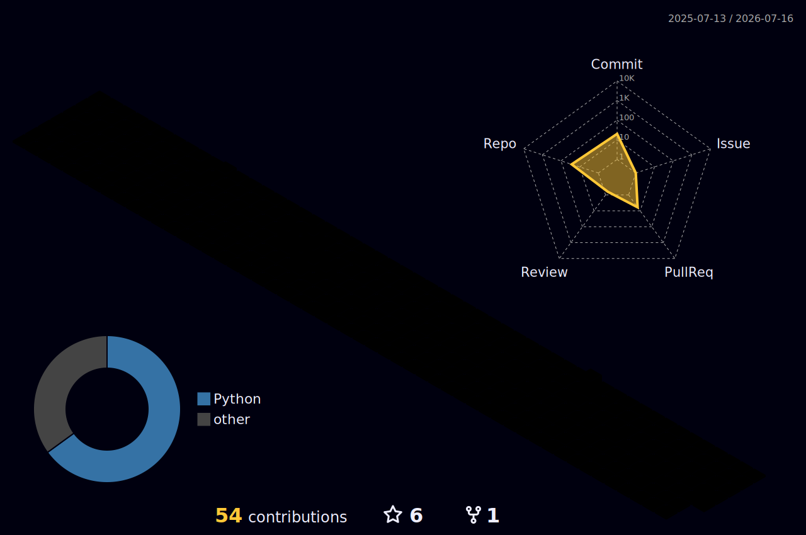

<!--
============================================================
  blackswan-mohu (墨鹄) · GitHub Profile README  [English · default]
  Special self-named repo: auto-rendered at https://github.com/blackswan-mohu
  Theme: rainbow gradient + auto light/dark adaptation (prefers-color-scheme)
  中文版见 README.zh-CN.md
============================================================
-->

<div align="center">

<!-- Language switch -->
<b>English</b> ·
<a href="./README.zh-CN.md">中文</a>

</div>

<!-- ===================== Header wave (rainbow) ===================== -->
<div align="center">


<!-- ===================== Typing tagline (auto light/dark) ===================== -->
<picture>
  <source media="(prefers-color-scheme: dark)" srcset="https://readme-typing-svg.demolab.com?font=Fira+Code&weight=600&size=24&duration=3000&pause=800&color=A855F7&center=true&vCenter=true&width=820&height=55&lines=Hi+there+%F0%9F%91%8B+I'm+blackswan;Vibe+Coding+%F0%9F%8E%A7;Full-Stack+Developer+%F0%9F%9A%80;Lifelong+Learner+%F0%9F%93%9A;Embracing+the+improbable+%F0%9F%A6%A2" />
  <source media="(prefers-color-scheme: light)" srcset="https://readme-typing-svg.demolab.com?font=Fira+Code&weight=600&size=24&duration=3000&pause=800&color=7C3AED&center=true&vCenter=true&width=820&height=55&lines=Hi+there+%F0%9F%91%8B+I'm+blackswan;Vibe+Coding+%F0%9F%8E%A7;Full-Stack+Developer+%F0%9F%9A%80;Lifelong+Learner+%F0%9F%93%9A;Embracing+the+improbable+%F0%9F%A6%A2" />
  
</picture>

<!-- ===================== Visitor counter ===================== -->
<br/>


</div>

---

## 🦢 About Me

> **The Black Swan** — rare, unpredictable events with a massive impact. Named after Nassim Taleb's book.
> I believe in growing through uncertainty and embracing every *improbable* with code.

```yaml
name:      墨鹄 / blackswan
role:      Full-Stack Developer
style:     Vibe Coding 🎧      # coding in the flow
mindset:   Lifelong Learner 📚 # a generalist, always curious
motto:     "Embrace uncertainty, turn black swans into opportunities"
```

- 🧩 **Generalist** — from frontend to backend, design to deployment, I love figuring it all out
- 🎧 **Vibe Coding** — headphones on, in the flow, letting intuition meet engineering
- 📚 **Lifelong Learner** — always `git pull`-ing new knowledge
- 🦢 **Antifragile** — the more volatility, the more I grow
- 💬 Ask me about tech, products, finance and everything uncertain

<div align="center">

<a href="https://github.com/blackswan-mohu"></a>

</div>

<!-- ===================== Random dev quote ===================== -->
<div align="center">

<picture>
  <source media="(prefers-color-scheme: dark)" srcset="https://quotes-github-readme.vercel.app/api?type=horizontal&theme=radical" />
  <source media="(prefers-color-scheme: light)" srcset="https://quotes-github-readme.vercel.app/api?type=horizontal&theme=light" />
  
</picture>

</div>

---

## 🛠️ Tech Stack

<div align="center">

**Languages**


**Frontend**


**Backend & DevOps**


**Tools**


</div>

---

## 📊 GitHub Stats

<div align="center">

<!-- Stats card (official Vercel instance is often overloaded -> community mirror sigma-five) -->
<picture>
  <source media="(prefers-color-scheme: dark)" srcset="https://github-readme-stats-sigma-five.vercel.app/api?username=blackswan-mohu&show_icons=true&hide_border=true&include_all_commits=true&count_private=true&rank_icon=github&theme=radical" />
  <source media="(prefers-color-scheme: light)" srcset="https://github-readme-stats-sigma-five.vercel.app/api?username=blackswan-mohu&show_icons=true&hide_border=true&include_all_commits=true&count_private=true&rank_icon=github&theme=default" />
  
</picture>
<!-- Top languages -->
<picture>
  <source media="(prefers-color-scheme: dark)" srcset="https://github-readme-stats-sigma-five.vercel.app/api/top-langs/?username=blackswan-mohu&layout=compact&hide_border=true&langs_count=8&theme=radical" />
  <source media="(prefers-color-scheme: light)" srcset="https://github-readme-stats-sigma-five.vercel.app/api/top-langs/?username=blackswan-mohu&layout=compact&hide_border=true&langs_count=8&theme=default" />
  
</picture>

<!-- Streak -->
<picture>
  <source media="(prefers-color-scheme: dark)" srcset="https://streak-stats.demolab.com?user=blackswan-mohu&hide_border=true&theme=radical" />
  <source media="(prefers-color-scheme: light)" srcset="https://streak-stats.demolab.com?user=blackswan-mohu&hide_border=true&theme=default" />
  
</picture>

</div>

---

## 🏆 Trophies

<div align="center">

<picture>
  <source media="(prefers-color-scheme: dark)" srcset="https://profile-trophy.vercel.app/?username=blackswan-mohu&no-frame=true&margin-w=10&margin-h=10&column=7&theme=radical" />
  <source media="(prefers-color-scheme: light)" srcset="https://profile-trophy.vercel.app/?username=blackswan-mohu&no-frame=true&margin-w=10&margin-h=10&column=7&theme=flat" />
  
</picture>

</div>

---

## 📇 Profile Summary

<div align="center">

<picture>
  <source media="(prefers-color-scheme: dark)" srcset="https://github-profile-summary-cards.vercel.app/api/cards/profile-details?username=blackswan-mohu&theme=github_dark" />
  <source media="(prefers-color-scheme: light)" srcset="https://github-profile-summary-cards.vercel.app/api/cards/profile-details?username=blackswan-mohu&theme=default" />
  
</picture>

<picture>
  <source media="(prefers-color-scheme: dark)" srcset="https://github-profile-summary-cards.vercel.app/api/cards/repos-per-language?username=blackswan-mohu&theme=github_dark" />
  <source media="(prefers-color-scheme: light)" srcset="https://github-profile-summary-cards.vercel.app/api/cards/repos-per-language?username=blackswan-mohu&theme=default" />
  
</picture>
<picture>
  <source media="(prefers-color-scheme: dark)" srcset="https://github-profile-summary-cards.vercel.app/api/cards/most-commit-language?username=blackswan-mohu&theme=github_dark" />
  <source media="(prefers-color-scheme: light)" srcset="https://github-profile-summary-cards.vercel.app/api/cards/most-commit-language?username=blackswan-mohu&theme=default" />
  
</picture>

<!-- 「活跃时段」卡片：看你一天中几点最能写码；utcOffset=8 = 北京时间 -->
<picture>
  <source media="(prefers-color-scheme: dark)" srcset="https://github-profile-summary-cards.vercel.app/api/cards/productive-time?username=blackswan-mohu&theme=github_dark&utcOffset=8" />
  <source media="(prefers-color-scheme: light)" srcset="https://github-profile-summary-cards.vercel.app/api/cards/productive-time?username=blackswan-mohu&theme=default&utcOffset=8" />
  
</picture>

</div>

---

## 🧊 3D Contribution Graph

<div align="center">

<!--
  立体柱状 3D 贡献图，由 .github/workflows/profile-3d.yml 自动生成并提交。
  首次生成需等 Action 跑完（约 1~2 分钟）后此图才会出现。
-->


</div>

---

## 😄 Dev Joke of the Moment

<div align="center">

<picture>
  <source media="(prefers-color-scheme: dark)" srcset="https://readme-jokes.vercel.app/api?theme=radical&hideBorder=true" />
  <source media="(prefers-color-scheme: light)" srcset="https://readme-jokes.vercel.app/api?theme=light&hideBorder=true" />
  
</picture>

</div>

---

<!-- ===================== Footer wave ===================== -->
<div align="center">


<sub>⭐ Growing through uncertainty · Stay curious, stay antifragile 🦢</sub>

</div>
