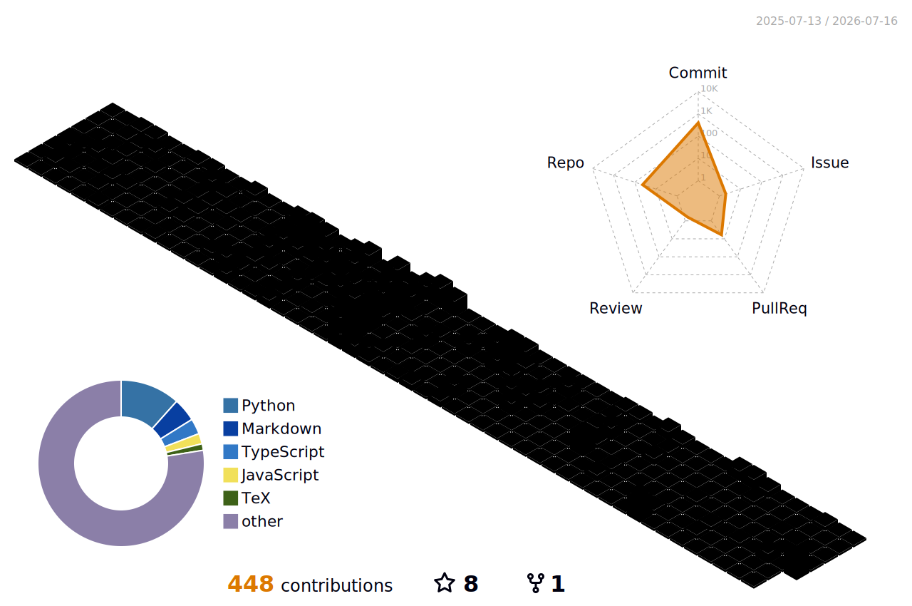

<!--
============================================================
  blackswan-mohu (墨鹄) · GitHub 个人主页 README  [中文版]
  英文默认版见 README.md（会渲染在主页）
  主题：彩虹渐变 + 自动适应明暗背景（prefers-color-scheme）
============================================================
-->

<div align="center">

<!-- 语言切换 -->
<a href="./README.md">English</a> ·
<b>中文</b>

</div>

<!-- ===================== 顶部波浪横幅（彩虹渐变） ===================== -->
<div align="center">


<!-- ===================== 打字机标语（自动适应明暗） ===================== -->
<picture>
  <source media="(prefers-color-scheme: dark)" srcset="https://readme-typing-svg.demolab.com?font=Fira+Code&weight=600&size=24&duration=3000&pause=800&color=A855F7&center=true&vCenter=true&width=820&height=55&lines=%E4%BD%A0%E5%A5%BD+%F0%9F%91%8B+%E6%88%91%E6%98%AF%E5%A2%A8%E9%B9%84+blackswan;Vibe+Coding+%F0%9F%8E%A7+%E8%B7%9F%E7%9D%80%E6%84%9F%E8%A7%89%E5%86%99%E4%BB%A3%E7%A0%81;%E5%85%A8%E6%A0%88%E5%BC%80%E5%8F%91%E8%80%85+%F0%9F%9A%80;%E7%BB%88%E8%BA%AB%E5%AD%A6%E4%B9%A0+%F0%9F%93%9A;%E6%8B%A5%E6%8A%B1%E4%B8%8D%E7%A1%AE%E5%AE%9A%E6%80%A7+%F0%9F%A6%A2" />
  <source media="(prefers-color-scheme: light)" srcset="https://readme-typing-svg.demolab.com?font=Fira+Code&weight=600&size=24&duration=3000&pause=800&color=7C3AED&center=true&vCenter=true&width=820&height=55&lines=%E4%BD%A0%E5%A5%BD+%F0%9F%91%8B+%E6%88%91%E6%98%AF%E5%A2%A8%E9%B9%84+blackswan;Vibe+Coding+%F0%9F%8E%A7+%E8%B7%9F%E7%9D%80%E6%84%9F%E8%A7%89%E5%86%99%E4%BB%A3%E7%A0%81;%E5%85%A8%E6%A0%88%E5%BC%80%E5%8F%91%E8%80%85+%F0%9F%9A%80;%E7%BB%88%E8%BA%AB%E5%AD%A6%E4%B9%A0+%F0%9F%93%9A;%E6%8B%A5%E6%8A%B1%E4%B8%8D%E7%A1%AE%E5%AE%9A%E6%80%A7+%F0%9F%A6%A2" />
  
</picture>

<!-- ===================== 访客计数 ===================== -->
<br/>


</div>

---

## 🦢 关于我

> **「黑天鹅」** —— 那些不可预测、却影响深远的稀有事件。名字取自 Nassim Taleb 的同名之作。
> 我只是想在不确定性中保持学习，慢慢成长一点点。🦢

```yaml
name:     墨鹄 / blackswan
role:     全栈开发者
style:    Vibe Coding 🎧
mindset:  一直在学习的路上 📚
motto:    "保持谦逊，持续学习，拥抱未知 🦢"
```

- 🌱 **还在摸索**：前端到后端都想学一点，什么都懂一点点
- 🎧 **Vibe Coding**：戴上耳机、沉浸其中，享受写代码的心流
- 📚 **持续学习**：尽量每天都 `git pull` 一点新知识
- 🦢 **反脆弱**：希望能在起起伏伏中慢慢成长
- 💬 欢迎和我聊聊技术、产品，以及所有不确定的事

<div align="center">

<a href="https://github.com/blackswan-mohu"></a>

<!-- 资料卡（transparent 主题，自动适应任意背景） -->


</div>

---

## 📊 GitHub 数据

<div align="center">

<!-- 统计卡（官方 Vercel 实例常年过载，改用社区镜像 sigma-five） -->
<picture>
  <source media="(prefers-color-scheme: dark)" srcset="https://github-readme-stats-sigma-five.vercel.app/api?username=blackswan-mohu&show_icons=true&hide_border=true&include_all_commits=true&count_private=true&rank_icon=github&theme=radical" />
  <source media="(prefers-color-scheme: light)" srcset="https://github-readme-stats-sigma-five.vercel.app/api?username=blackswan-mohu&show_icons=true&hide_border=true&include_all_commits=true&count_private=true&rank_icon=github&theme=default" />
  
</picture>
<!-- 连续贡献 streak -->
<picture>
  <source media="(prefers-color-scheme: dark)" srcset="https://streak-stats.demolab.com?user=blackswan-mohu&hide_border=true&locale=zh_Hans&theme=radical" />
  <source media="(prefers-color-scheme: light)" srcset="https://streak-stats.demolab.com?user=blackswan-mohu&hide_border=true&locale=zh_Hans&theme=default" />
  
</picture>

</div>

---

## 🏆 成就

<div align="center">

<picture>
  <source media="(prefers-color-scheme: dark)" srcset="https://profile-trophy.vercel.app/?username=blackswan-mohu&no-frame=true&margin-w=10&margin-h=10&column=7&theme=radical" />
  <source media="(prefers-color-scheme: light)" srcset="https://profile-trophy.vercel.app/?username=blackswan-mohu&no-frame=true&margin-w=10&margin-h=10&column=7&theme=flat" />
  
</picture>

</div>

---

## 🧊 3D 立体贡献图

<div align="center">

<!--
  立体柱状 3D 贡献图（彩虹配色），由 .github/workflows/profile-3d.yml 自动生成。
  单文件内置 darkMode（@media prefers-color-scheme），彩虹效果 + 自动跟随明暗背景。
-->


</div>

---

<!-- ===================== 底部波浪 ===================== -->
<div align="center">


<sub>⭐ 从不确定性中生长 · Stay curious, stay antifragile 🦢</sub>

</div>
